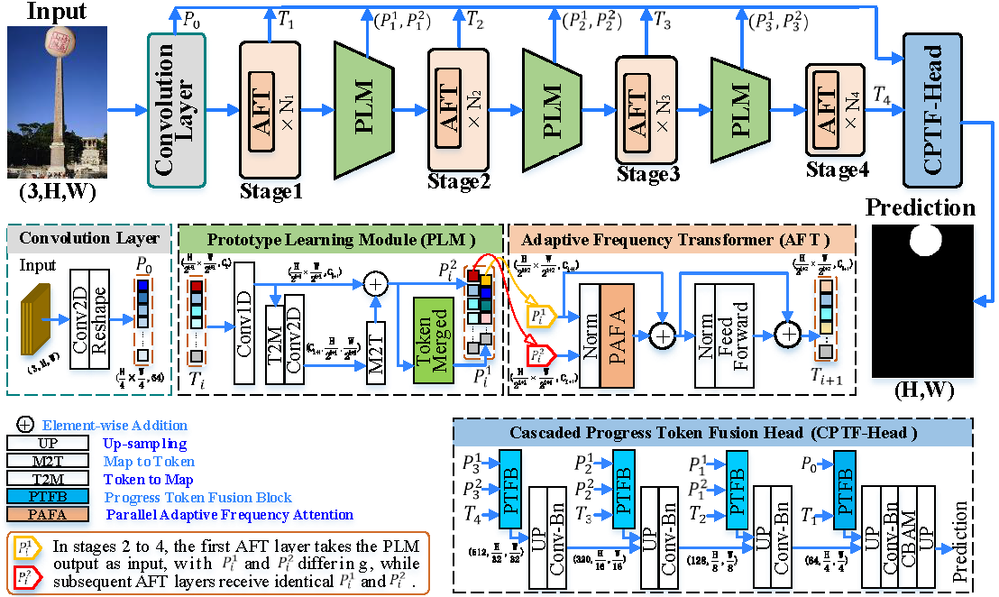

# (TCSVT) DFFormer: Capturing Dynamic Frequency Features to Locate Image Manipulation through Adaptive Frequency Transformer and Prototype Learning


This repo holds code for the paper[DFFormer: Capturing Dynamic Frequency Features to Locate Image Manipulation through Adaptive Frequency Transformer and Prototype Learning](https://ieeexplore.ieee.org/abstract/document/11134492?casa_token=xL_tKcO99U4AAAAA:SdEWW7_g_jw9nhTrvttm8C8WxmA7ehvBc4e7JFLM_fJKfLJ0RLOxj8AnKXXWU1AOWBTFj55d_myr_w)

Thanks for the IMDL-BenCo framework.


## Usage

### 1. Download pre-trained models
* [Get models in this link](https://drive.google.com/drive/folders/1S1BJyFWw4Tlb_ItdtzL9J1TV_as9tIbt?usp=drive_link): DFFormer-light, DFFormer-small, DFFormer-large


### 2. Prepare data

Please download the IML-MUST dataset.<br>
* [Baidu Disk](https://pan.baidu.com/s/180TzwbTHj1Q3FOvIwT3vyg?pwd=gdit) <br>

### 3. Environment

Please prepare an environment with Python 3.8 and PyTorch 1.10.1, and then use the command "pip install -r requirements.txt" to install the dependencies.

### 4. Train/Test

- Run the train script on the CASIA v2 dataset with n GPUs.
```bash
#!/bin/bash 
torchrun --nproc_per_node=n ddp_train.sh
```
- Or run the train script on the CASIA v2 dataset with a single GPU.
```bash
#!/bin/bash 
python ./dfformer/training_scripts/train.py.
```

- Run the test script on the Coverage dataset.

```bash
python ./dfformer/training_scripts/test.py  --model_name  dfformer-large
```

### 5. CKPT
* [Google Dirve](https://drive.google.com/drive/folders/1S1BJyFWw4Tlb_ItdtzL9J1TV_as9tIbt?usp=drive_link)
* [Baudu Disk](https://pan.baidu.com/s/1x9SkoEO8-QWA7yquSgx1Ew?pwd=gdit)

## Citations

```@ARTICLE{11134492,
  author={Xiang, Yan and Zhao, Kaiqi and Yu, Zhenghong and Yuan, Xiaochen and Huang, Guoheng and Tian, Jinyu and Li, Jianqing},
  journal={IEEE Transactions on Circuits and Systems for Video Technology}, 
  title={DFFormer: Capturing Dynamic Frequency Features to Locate Image Manipulation through Adaptive Frequency Transformer and Prototype Learning}, 
  year={2025},
  volume={},
  number={},
  pages={1-1},
  doi={10.1109/TCSVT.2025.3601659}}

```

